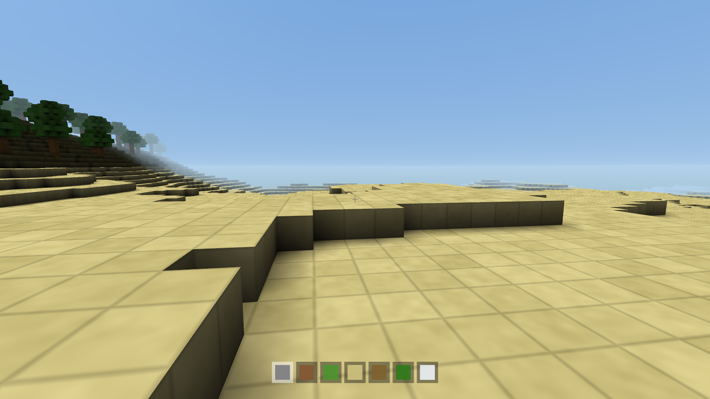
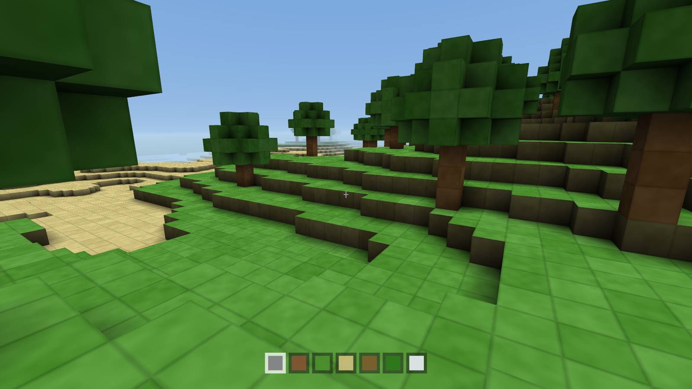
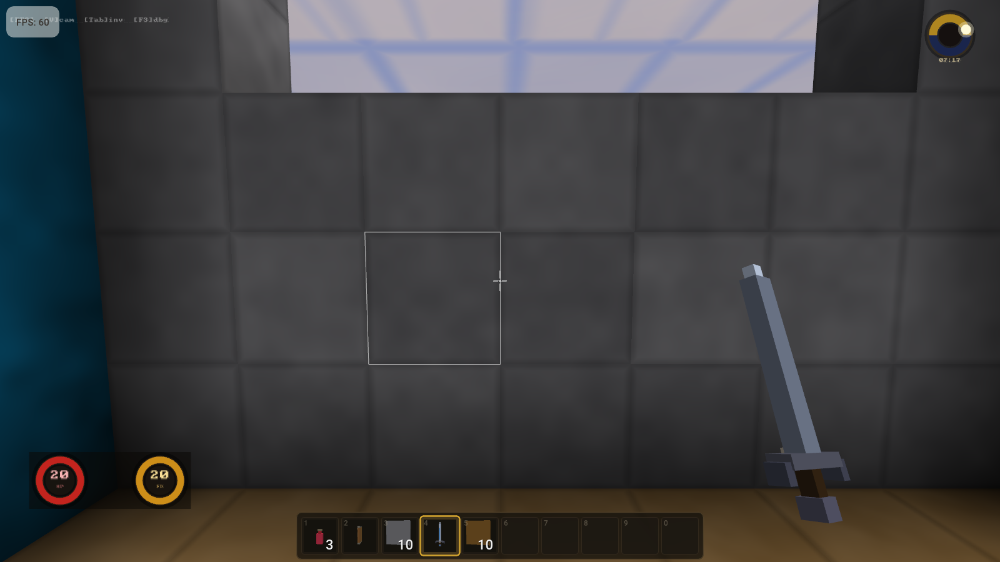
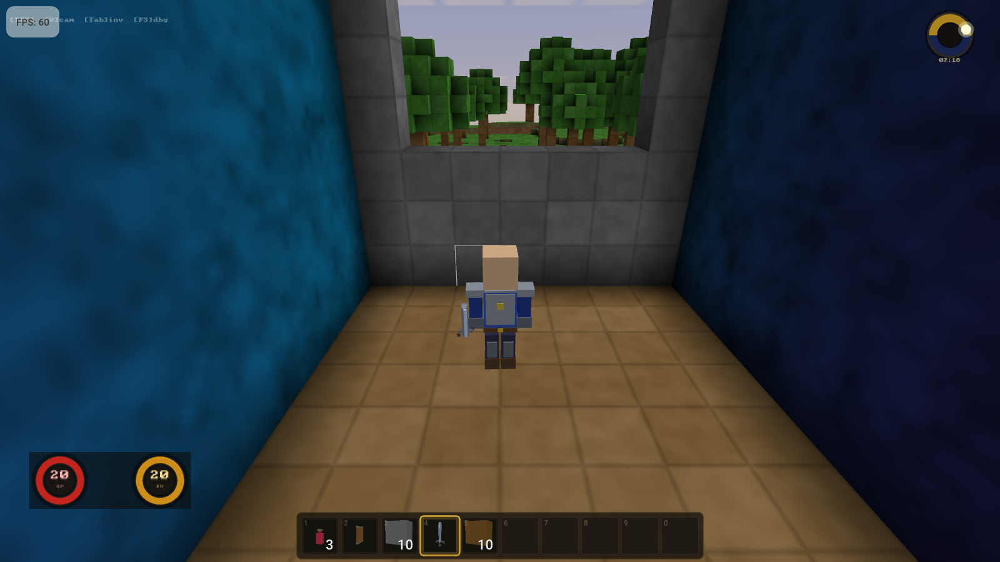
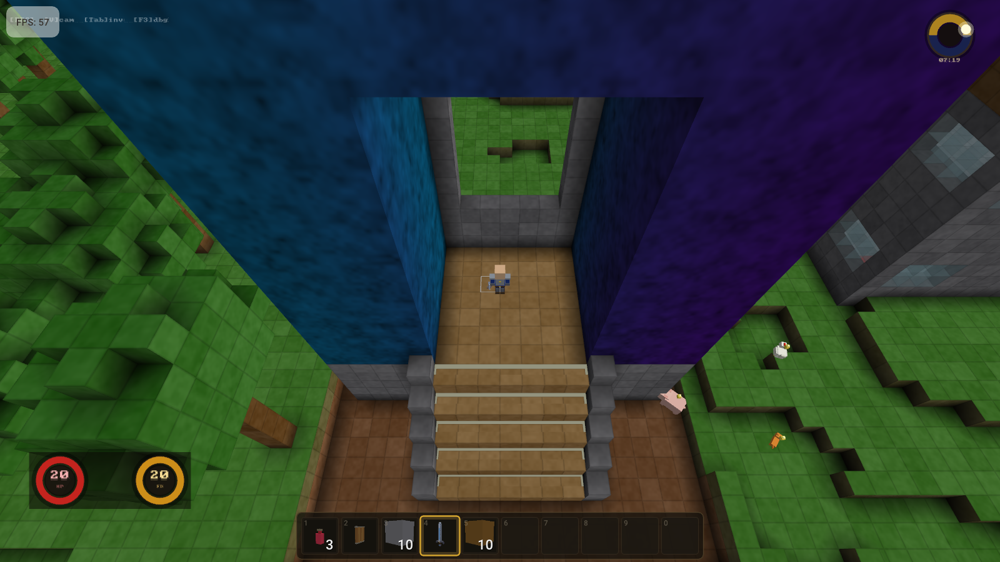
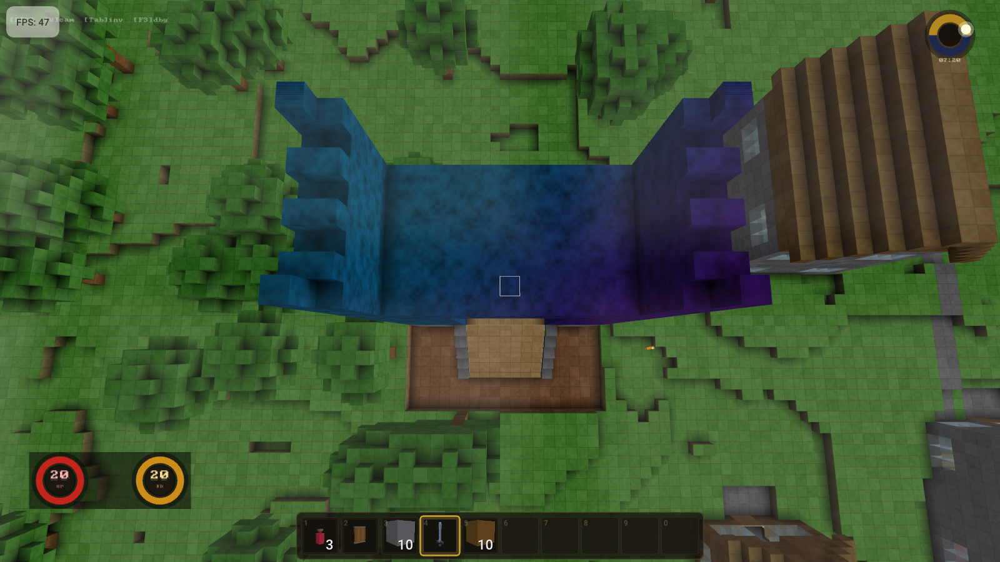

# ModCraft Build Log

Visual progression of the engine, screenshot per version.

---

## v0.1.0 -- Flat World (Day 1)

First working build. Flat green plane + sky gradient + crosshair. MSAA anti-aliasing. WASD + mouse movement.

## v0.2.0 -- Terrain Generation (Day 1)

Noise-based terrain with hills. Trees. Sand beaches. Snow peaks. Per-vertex AO. Face shading. Procedural block textures. Hotbar. Block mining/placing. Fly + walk modes.

## v0.3.0 -- Hills & Trees (Day 1)

Better spawn point. Trees visible. AO shadows prominent. Block grid lines. Hotbar with selected slot. Terrain transitions. Fog.

## v0.4.0 -- Block Registry + Entity System (Day 1)

Replaced hardcoded BlockType enum with BlockRegistry (string ID <-> numeric ID). BlockDef with full metadata. Passive/Active block split. Active blocks: TNT, Wheat, Wire, NAND Gate. Entity class with properties. EntityManager. Built-in entities: Player, Pig, ItemEntity. Python model: 36 block types, 6 action types.

## v0.5.0 -- Title Screen + Game Modes (Day 1)

Title screen with bitmap font. Menu buttons: Single Player, Creative Mode, Quit. Creative: fly towards cursor. Survival: gravity + jumping. ESC returns to menu. HUD text.

## v0.5.1 -- Four Camera Views (Day 1)

Four views (V to cycle): 1st Person, 3rd Person, God View, RTS. Player is 2 blocks tall, eye at 1.5 blocks. Scroll to zoom in 3rd/god/RTS.

## v0.6.0 -- 3D Models + Mobs (Day 1)

3D box models: Player (head/body/arms/legs), Pig (body/snout/legs), Chicken (body/beak/wattle/legs/tail). Mob wander AI. Ground collision for mobs. 4 pigs + 3 chickens spawned near player.

## v0.7.0 -- Constants Refactor (Day 1)

Extracted ALL hardcoded strings into `src/common/constants.h`:
- 15 block type IDs (BlockType namespace)
- 4 entity type IDs (EntityType namespace)
- 10 category strings (Category namespace)
- 19 property names (Prop namespace)
- 18 group names (Group namespace)
- 3 tool groups (Tool namespace)
- 12 sound names (Sound namespace)
- 6 asset names (Asset namespace)
- 4 Python class IDs (PyClass namespace)

Zero raw string literals remain in game logic code.

---

## v0.9.0 -- Visual Polish (Current)

Major rendering overhaul. Block textures now have Minecraft Dungeons-style vibrant saturation (+45%), face-normal-aware procedural grain (top faces: swirling XZ noise; sides: vertical streaks), and stronger edge-darkening grid lines. Per-block color variation increased. Procedural cloud layer in sky shader (3-octave 2D noise, time-scrolled). Dawn/dusk warm tint peaks at sunrise/sunset. Distance fog. Smooth stair camera (asymmetric lerp, lag cap prevents portal-staircase camera trail). Hitmarker crosshair (orange on hit, red on kill). FPS hand bob (walk-speed-scaled sine wave). Unified FloatingTextSystem: damage numbers above enemies, pickup notifications in HUD lane, mode-aware (FPS near crosshair, TPS/RPG world-projected, RTS selected-only), entry coalescing, pop-in animation.

## Version History

| Version | Focus | Key Addition |
|---------|-------|-------------|
| 0.1.0 | Foundation | OpenGL window, flat world, camera |
| 0.2.0 | Terrain | Noise hills, trees, AO, hotbar |
| 0.3.0 | Polish | Better spawn, visible terrain features |
| 0.4.0 | Architecture | BlockRegistry, EntityManager, Python model |
| 0.5.0 | UI | Title screen, game modes, text rendering |
| 0.5.1 | Camera | 4 views (FPS/3rd/God/RTS) |
| 0.6.0 | Entities | 3D models, pig/chicken AI |
| 0.7.0 | Code quality | Constants refactor, zero hardcoded strings |
| 0.9.0 | Visual polish | Vibrant textures, clouds, floating text, hitmarker, hand bob |
